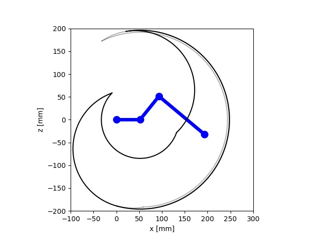
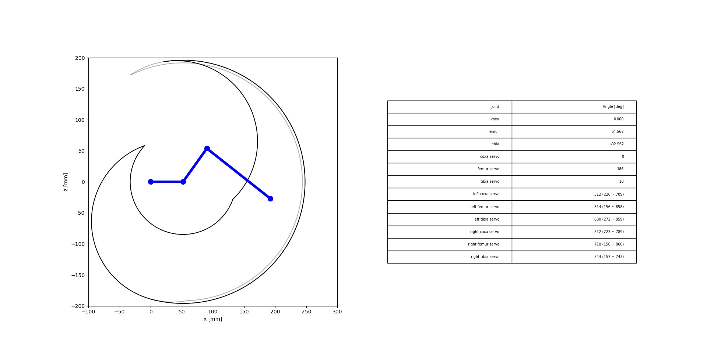
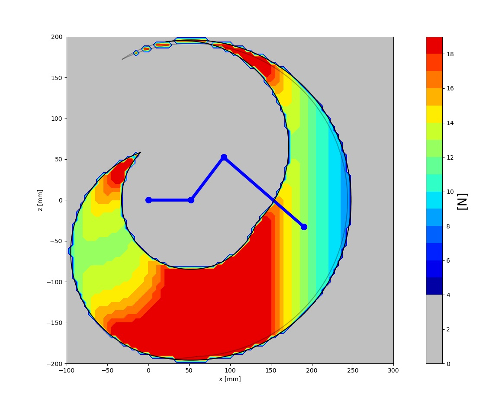
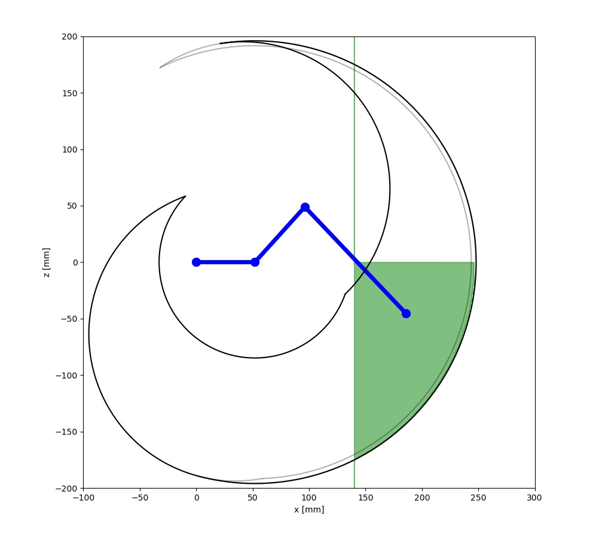
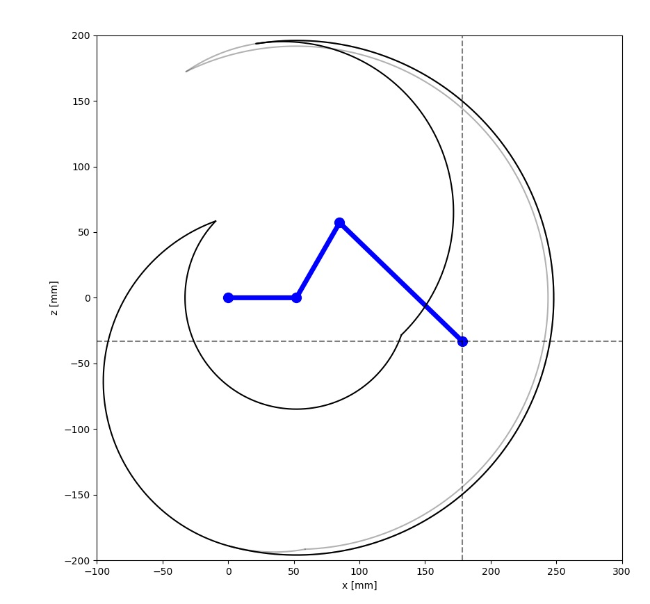
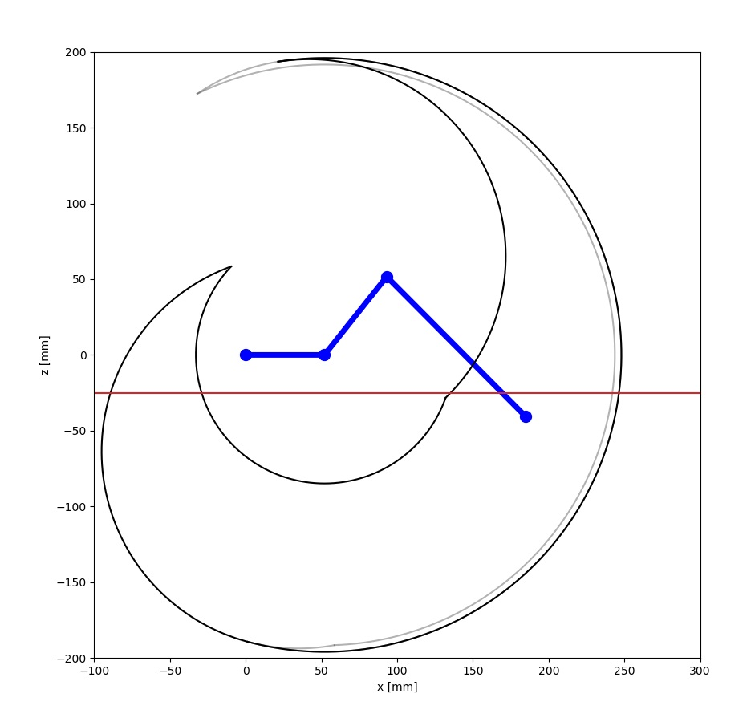
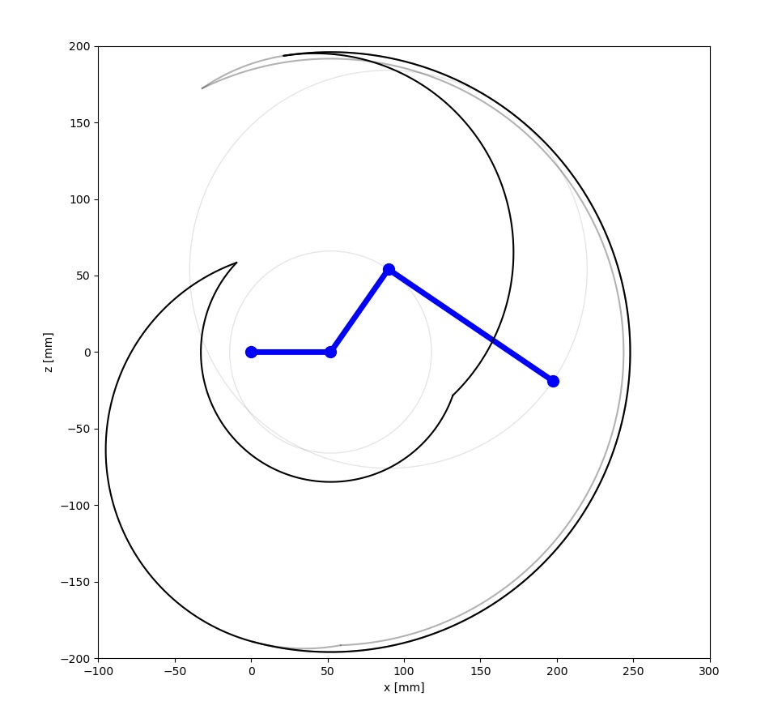
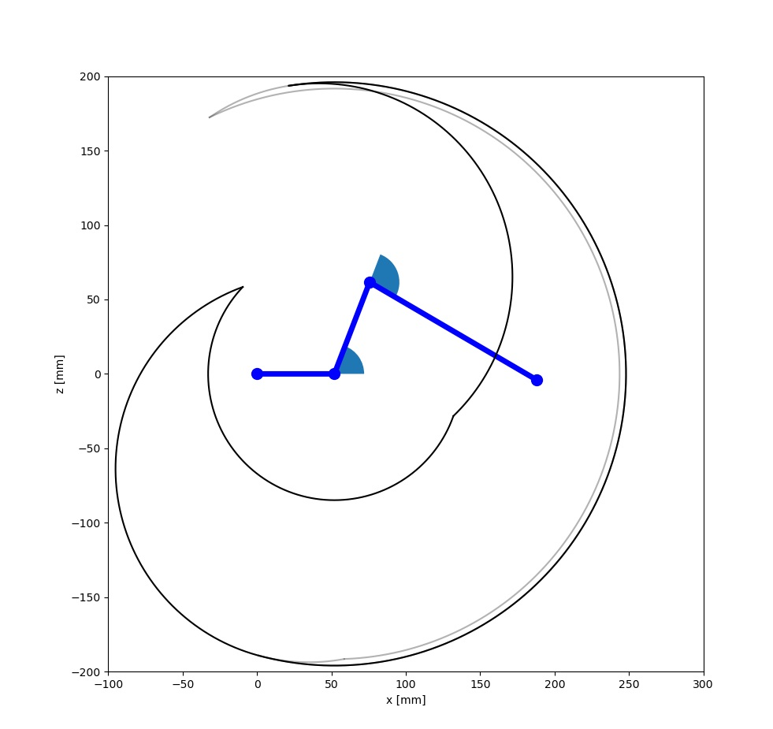

# GraphDisplayerについて

`GraphDisplayer`クラスは，脚の図示を行うクラスです．
`GraphDisplayer`は`display`メソッドのみを持ちます．
`display`メソッドは多くの引数を持ちますが，デフォルト値が設定されています．
これらを変更することで，脚の図示をカスタマイズできます．

<div align="center">
    
</div>

## 目次

- [displayメソッド](#displayメソッド)
  - [引数](#引数)
    - [hexapod_pram](#hexapod_pram)
    - [rect](#rect)
    - [display_flag](#display_flag)
    - [color_param](#color_param)
    - [leg_power_step](#leg_power_step)
    - [image_file_name](#image_file_name)
    - [ground_z](#ground_z)
    - [do_not_show](#do_not_show)
    - [figure, axes, axes_table](#figure-axes-axes_table)

## displayメソッド

### 引数

```python
def display(
    self,
    hexapod_pram : HexapodParamProtocol,
    *,
    rect: Tuple[float, float, float, float] = (-100.0, 300.0, -200.0, 200.0),
    display_flag: DisplayFlag = DisplayFlag(),
    color_param: ColorParam = ColorParam(),
    leg_power_step: float =2.0,
    image_file_name: str="result/img_main.png",
    ground_z: float =-25.0,
    do_not_show: bool =False,
    figure : Optional[Figure] = None,
    axes: Optional[Axes] = None,
    axes_table: Optional[Axes] = None,
    ) -> None:
    ...
```

### hexapod_pram

`HexapodParamProtocol`を継承したクラスのインスタンスを指定します．
`HexapodParamProtocol`は脚ロボットのパラメータを保持するインターフェースです．
この引数のみは必須です．
詳細は[HexapodParamProtocolについて](docs/about_hexapod_param.md)を参照してください．

### rect

表示する範囲を指定します．単位はmmです．
float のタプルで，(x_min, x_max, z_min, z_max)の順に指定します．

近似された可動範囲のグラフと，脚先力の計算に影響します．
過不足なく可動範囲を囲むように設定してください．

### display_flag

`DisplayFlag`クラスのインスタンスを指定します．
`DisplayFlag`クラスは，表示するグラフの設定を行うクラスです．

```python
class DisplayFlag:
    approximated_graph_filled: bool = True
    leg_circle_displayed: bool = True
    leg_wedge_displayed: bool = True
    display_table: bool = True
    display_leg_power: bool = False
    display_approximated_graph: bool = False
    display_mouse_grid: bool = True
    display_ground_line: bool = False
```

#### display_table

Trueの場合，テーブルを表示します．

<div align="center">
    
</div>

#### display_leg_power

Trueの場合，脚先力を表示します．
計算に時間がかかるため，不必要な場合はFalseを推奨します．
詳細は[sample_main2.py](../sample_main2.py)を参照してください．

<div align="center">
    
</div>

#### display_approximated_graph

Trueの場合，近似された可動範囲のグラフを表示します．

<div align="center">
    
</div>

#### display_mouse_grid

Trueの場合，マウス追従するグリッド線を表示します．

<div align="center">
    
</div>

#### display_ground_line

Trueの場合，地面の線を表示します．

<div align="center">
    
</div>

#### leg_circle_displayed

Trueの場合，脚の可動範囲を円で表示します．

<div align="center">
    
</div>

#### leg_wedge_displayed

Trueの場合，脚の可動範囲を扇形で表示します．

<div align="center">
    
</div>

#### approximated_graph_filled

Trueの場合，近似された可動範囲のグラフを塗りつぶします．

### color_param

`ColorParam`クラスのインスタンスを指定します．
`ColorParam`クラスは，グラフの色を設定するクラスです.

### leg_power_step

脚先力を計算する際のステップ幅を指定します．単位はmmです．
ステップ幅が小さいほど，計算時間がかかります．
範囲にもよりますが，400mm*400mmの範囲であれば，2.0程度で十分です．

マイナスの値は指定できません．

### image_file_name

画像を保存するファイル名を指定します．

### ground_z

地面の高さを指定します．単位はmmです．

### do_not_show

Trueの場合，グラフを表示しません．
通常, displayメソッドの最後に`plt.show()`が実行されますが,
この引数をTrueにすると，`plt.show()`が実行されません．

### figure, axes, axes_table

`matplotlib.figure.Figure`と`matplotlib.axes.Axes`のインスタンスを指定します．
通常は指定する必要はありません．（内部で生成されます）
ただし，すでに生成されたFigureやAxesを使用したい場合は，これらの引数を指定することができます．
