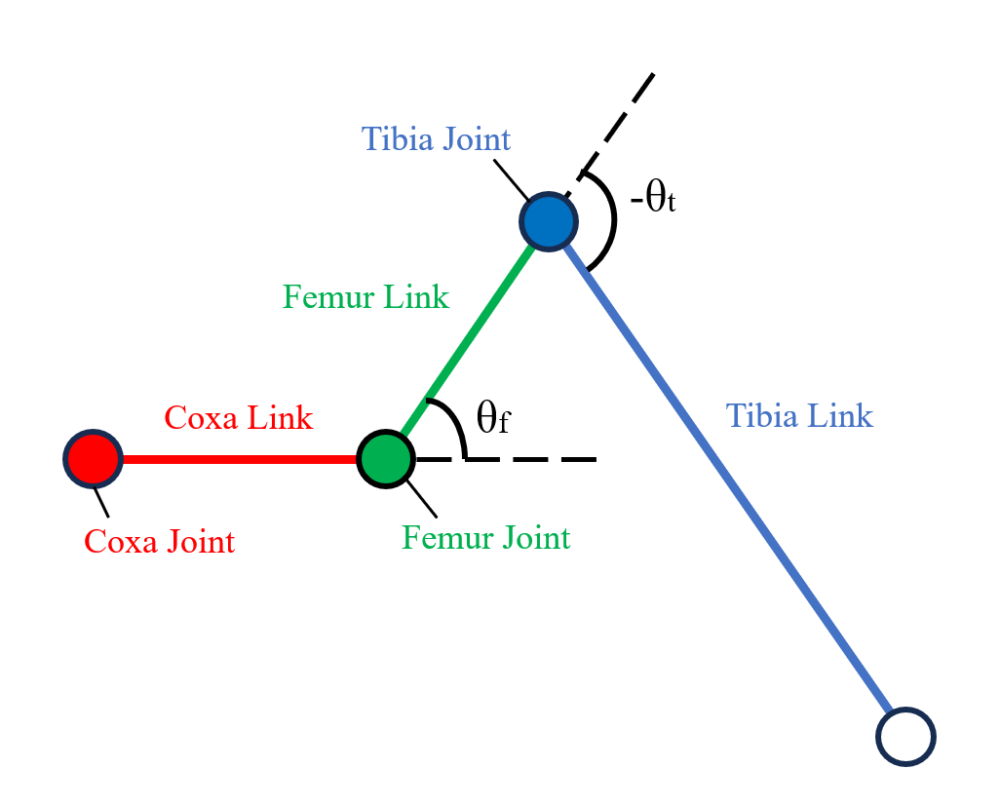
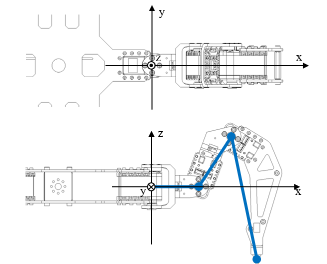
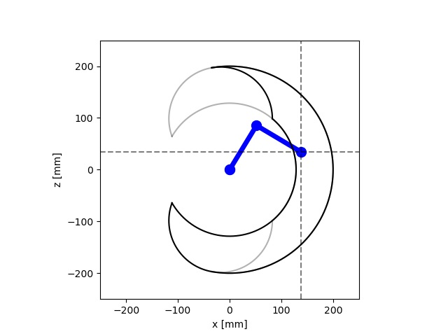

# HexapodParamProtocolについて

構造体 HexapodParamProtocol は，脚ロボットのパラメータを保持するためのプロトコルです．
このプロトコルは，脚の長さや関節の可動範囲など，脚ロボットの動作に必要な情報を定義しています．
このドキュメントでは，HexapodParamProtocol の各パラメータの説明と、サンプルコードを示します．


## 目次

- [HexapodParamProtocolについて](#hexapodparamprotocolについて)
  - [目次](#目次)
  - [パラメータの説明](#パラメータの説明)
    - [脚の長さ](#脚の長さ)
    - [間接の可動範囲](#間接の可動範囲)
    - [その他のパラメータ](#その他のパラメータ)
  - [サンプル](#サンプル)

## パラメータの説明

```python
class HexapodParamProtocol(Protocol):
    coxa_length: float  # [mm]
    femur_length: float  # [mm]
    tibia_length: float  # [mm]
    theta1_max: float  # [deg]
    theta1_min: float  # [deg]
    theta2_max: float  # [deg]
    theta2_min: float  # [deg]
    theta3_max: float  # [deg]
    theta3_min: float  # [deg]
    torque_max: float  # [N*mm] ストールトルク(停動トルク)
    approx_min_radius: float  # [mm]
    approx_max_radius: float  # [mm]
```

### 脚の長さ

`HexapodParam`では，各リンクの名前を PhantomX に倣い，`coxa`, `femur`, `tibia`としています．

`coxa_length`は，脚の第1関節から第2関節までの長さを指定します．

`femur_length`は，脚の第2関節から第3関節までの長さを指定します．

`tibia_length`は，脚の第3関節から脚先までの長さを指定します．

なお，すべてのパラメータは0以上の値を指定してください．

### 間接の可動範囲

関節の角度を表す変数は`coxa`, `femur`, `tibia`の順に`theta1`, `theta2`, `theta3`としています．

`theta1`は座標軸に対して右ねじの方向を正としています．
`theta2` `theta3`は，下図における反時計回りを正としています．

`theta1_max` `theta1_min`は，第1関節の最大・最小角度を指定します．
単位は degree です.
このプログラムでは2次元平面上に表示するため，実質的にこの値は無意味なものになります．

`theta2_max` `theta2_min`は，第2関節の最大・最小角度を指定します．

`theta3_max` `theta3_min`は，第3関節の最大・最小角度を指定します．

すべて-180 [deg]から180 [deg]の範囲で指定してください．また，最小を最大より大きく指定しないでください．

<div align="center">
    <p>
        
        
    </p>
</div>

### その他のパラメータ

`torque_max`は，サーボモータのストールトルク（停動トルク）を指定します．
単位が［N*mm］となっていることに注意してください．

`approx_min_radius`，`approx_max_radius`は，近似された可動範囲のグラフを表示する際のパラメータを指定します．
私の研究のために作成したものであるので，無視しても問題ありません．

## サンプル

以下の図は，`coxa_length=0,0`，`femur_length=100.0`，`tibia_length=100.0`のパラメータで表示したものです．
また，可動域を`theta2_max=100.0`，`theta2_min=-100.0`，`theta3_max=100.0`，`theta3_min=-100.0`としています．
具体的には以下のようなパラメータを持つ`HexapodParam`を用いています．

```python
    class OriginalRobotParam(hxr.HexapodParamProtocol):
        coxa_length: float = 0.0  # [mm]
        femur_length: float = 100.0  # [mm]
        tibia_length: float = 100.0  # [mm]
        theta1_max: float = math.radians(0.0)  # [rad]
        theta1_min: float = math.radians(0.0)  # [rad]
        theta2_max: float = math.radians(100.0)  # [rad]
        theta2_min: float = math.radians(-100)  # [rad]
        theta3_max: float = math.radians(100.0)  # [rad]
        theta3_min: float = math.radians(-100.0)  # [rad]
        torque_max: float = 0.0  # [N*mm] ストールトルク(停動トルク)
        approx_min_radius: float = 0  # [mm]
        approx_max_radius: float = 250.0  # [mm]
```

[sample_main3.py](../sample_main3.py)では，このパラメータを用いて脚の可動域を表示しています．
詳細はそちらを参照してください．

<div align="center">
    
</div>
